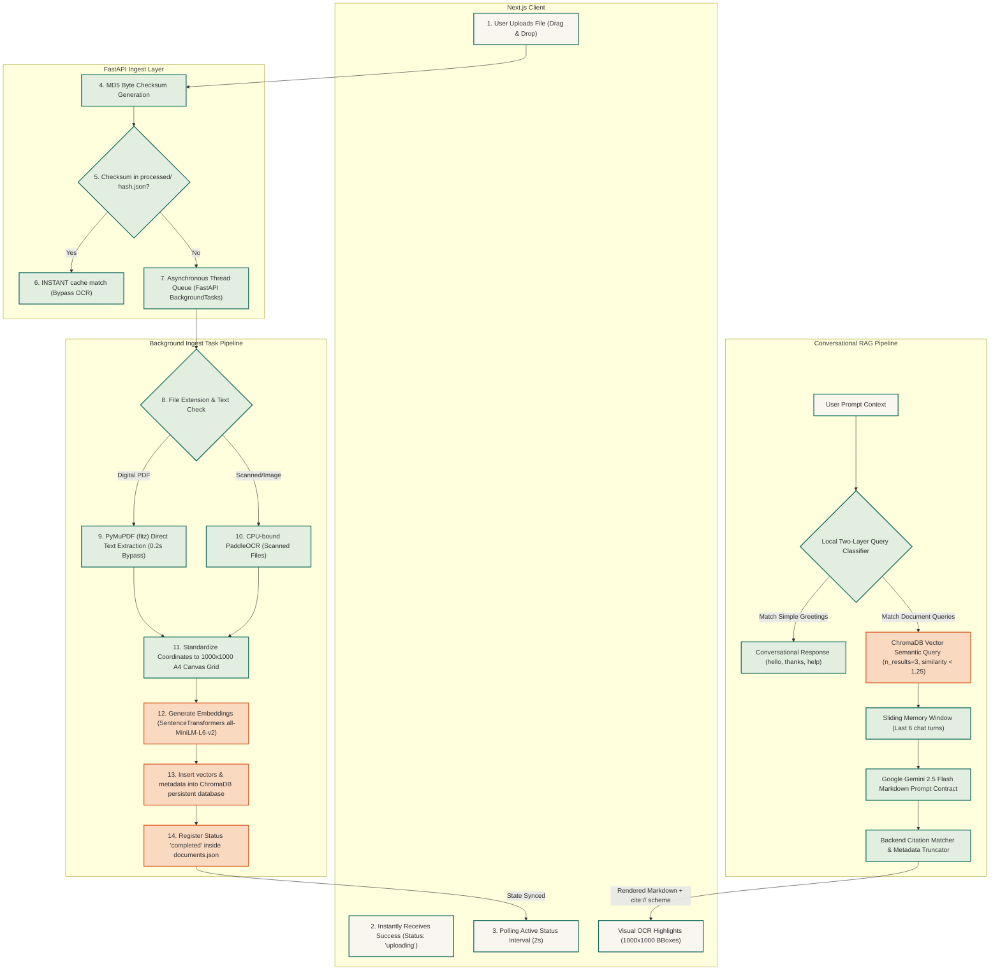

# 🏛️ System Architecture - KnowDoc Platform

KnowDoc represents a production-grade **Retrieval-Augmented Generation (RAG)** system designed for visual document auditing. It optimizes document ingestion throughput and semantic alignment using the pipeline detailed below.

---

## 📐 Ingestion & Conversation Pipeline

The diagram below maps the absolute sequential flow of a file uploaded by the client through the ingestion validation, asynchronous extraction, vector indexing, conversational reasoning, and visual coordinate highlight rendering phases:

---

## 🦾 Core Architectural Techniques & Benefits

### 1. Ultra-Fast Ingestion Response (Background Execution)
*   **Technique**: When a user drops a file, it is saved to storage and registered inside `documents.json` with state `"uploading"`. The server instantly replies `200 OK` to the React client.
*   **Benefit**: The frontend transitions to a loading state and displays dynamic progress animations, preventing browser timeout blocks during heavy extraction jobs.

### 2. Digital PDF Native Extraction Bypass
*   **Technique**: A regular PDF has characters mapped in layout positions. PyMuPDF (`fitz`) extracts the text layer directly.
*   **Benefit**: Ingestion finishes in **0.2 seconds** instead of the typical 20 seconds needed for heavy visual OCR models, reducing processing load on standard CPUs.

### 3. MD5 Duplicate Document Checksum Deduplication
*   **Technique**: Before starting extraction, the server generates an MD5 checksum of the binary array. If this checksum file path (`backend/app/db/data/processed/{hash}.json`) exists, extraction, chunking, and embedding generation are skipped.
*   **Benefit**: High-speed, sub-millisecond duplicate checks prevent database redundancy.

### 4. Layout Standardizing (1000x1000 Canvas Coordinate Grid)
*   **Technique**: Normalizes page widths and heights to standard coordinate ranges `[0-1000]`.
*   **Benefit**: The frontend visual inspector overlay accurately matches PDF elements with CSS highlight rectangles across responsive screen dimensions.

### 5. Vector Index & Distance Truncation
*   **Technique**: Chunks text blocks using overlapping sliders, vectorizes context using a local `SentenceTransformer("all-MiniLM-L6-v2")` model, and checks distance inside a ChromaDB collection (`backend/app/vector_db`).
*   **Constraints**:
    - Limits retrieve queries to `n_results=3` chunks.
    - Rejects contexts with an L2 vector distance `>= 1.25`.

### 6. RAG Chat Session Storage & Response Parsing
*   **Technique**: Keeps browser session data synced using UUID keys in standard `localStorage`. Synchronizes conversations directly through persistent CRUD chat endpoints to `chats.json`.
*   **Post-Processing Citation Scheme**: Gemini output references `[Doc X, Page Y]`, which the frontend converts into markdown anchors pointing to a custom URL scheme `cite://X/Y` to enable interactive highlight focus.
